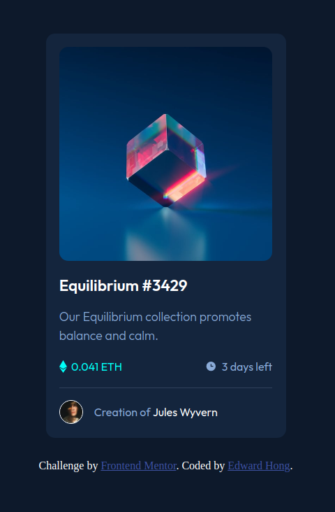

# Frontend Mentor - NFT preview card component solution

This is a solution to the [NFT preview card component challenge on Frontend Mentor](https://www.frontendmentor.io/challenges/nft-preview-card-component-SbdUL_w0U). Frontend Mentor challenges help you improve your coding skills by building realistic projects.

## Table of contents

- [Frontend Mentor - NFT preview card component solution](#frontend-mentor---nft-preview-card-component-solution)
  - [Table of contents](#table-of-contents)
  - [Overview](#overview)
    - [The challenge](#the-challenge)
    - [Screenshot](#screenshot)
    - [Links](#links)
  - [My process](#my-process)
    - [Built with](#built-with)
    - [What I learned](#what-i-learned)
    - [Continued development](#continued-development)
    - [Useful resources](#useful-resources)
  - [Author](#author)
  - [Acknowledgements](#acknowledgements)

## Overview

### The challenge

Users should be able to:

- View the optimal layout depending on their device's screen size
- See hover states for interactive elements

### Screenshot



### Links

- Solution URL: [Github](https://github.com/Code-Course-Reviews/100-days-of-code/tree/main/nft-preview-card-component)
- Live Site URL: [Surge](https://nft-preview-card-component-fm.surge.sh/)

## My process

### Built with

- Semantic HTML5 markup
- CSS custom properties
- Flexbox
- Mobile-first workflow
- [Sass](https://sass-lang.com/) - CSS Compiler

### What I learned

Better understanding of using Sass. Creating responsive images with absolute positioning 0 value for top, bottom, right and left properties.

```scss
&-hover-overlay {
  border-radius: 0.8rem;
  top: 0;
  left: 0;
  bottom: 0;
  right: 0;
  background-color: rgba(0, 255, 257, 0.5);
  align-items: center;
  justify-content: center;
  position: absolute;
  display: none;
}
```

### Continued development

Adding further knowledge for Sass including using mixins and functions.

### Useful resources

- [Sass Documentation](https://sass-lang.com/documentation/)

## Author

- Website - [Edward Hong](https://edwardhong.tech)
- Frontend Mentor - [@edward-hong](https://www.frontendmentor.io/profile/edward-hong)
- Twitter - [@codecourserevs](https://twitter.com/codecourserevs)
- Youtube - [@codecoursereviews](https://www.youtube.com/channel/UCMZA3I7RsWzerxqeTQf_VHQ)
- Reddit - [@codecoursereviews](https://www.reddit.com/user/codecoursereviews)

## Acknowledgements

Thank you to my Youtube viewers for the encouragement to continue with the #100DaysOfCode challenge.
