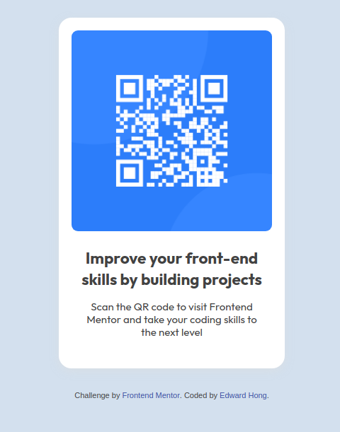

# Frontend Mentor - QR code component solution

This is a solution to the [QR code component challenge on Frontend Mentor](https://www.frontendmentor.io/challenges/qr-code-component-iux_sIO_H). Frontend Mentor challenges help you improve your coding skills by building realistic projects.

## Table of contents

- [Frontend Mentor - QR code component solution](#frontend-mentor---qr-code-component-solution)
  - [Table of contents](#table-of-contents)
  - [Overview](#overview)
    - [Screenshot](#screenshot)
    - [Links](#links)
  - [My process](#my-process)
    - [Built with](#built-with)
    - [What I learned](#what-i-learned)
    - [Continued development](#continued-development)
  - [Author](#author)
  - [Acknowledgements](#acknowledgements)

## Overview

### Screenshot



### Links

- Solution URL: [Github](https://github.com/Code-Course-Reviews/100-days-of-code/tree/main/qr-code-component)
- Live Site URL: [Surge](https://qr-code-component.surge.sh)

## My process

### Built with

- Semantic HTML5 markup
- CSS custom properties
- Mobile-first workflow
- [Mustard CSS](https://kylelogue.github.io/mustard-ui/index.html) - CSS Framework

### What I learned

I learnt to use rems instead of pixels as unit of measurement. Setting the base rem size in the `html` selector. Also got a little bit familiar with Mustard CSS.

```css
html {
  font-size: 15px;
}
```

### Continued development

Maybe something to work on is finding a more complex project that I can further explore what Mustard CSS has to offfer.

## Author

- Website - [Edward Hong](https://edwardhong.tech)
- Frontend Mentor - [@edward-hong](https://www.frontendmentor.io/profile/edward-hong)
- Twitter - [@codecourserevs](https://twitter.com/codecourserevs)
- Youtube - [@codecoursereviews](https://www.youtube.com/channel/UCMZA3I7RsWzerxqeTQf_VHQ)
- Reddit - [@codecoursereviews](https://www.reddit.com/user/codecoursereviews)

## Acknowledgements

Thank you to my Youtube viewers for the encouragement to continue with the #100DaysOfCode challenge.
